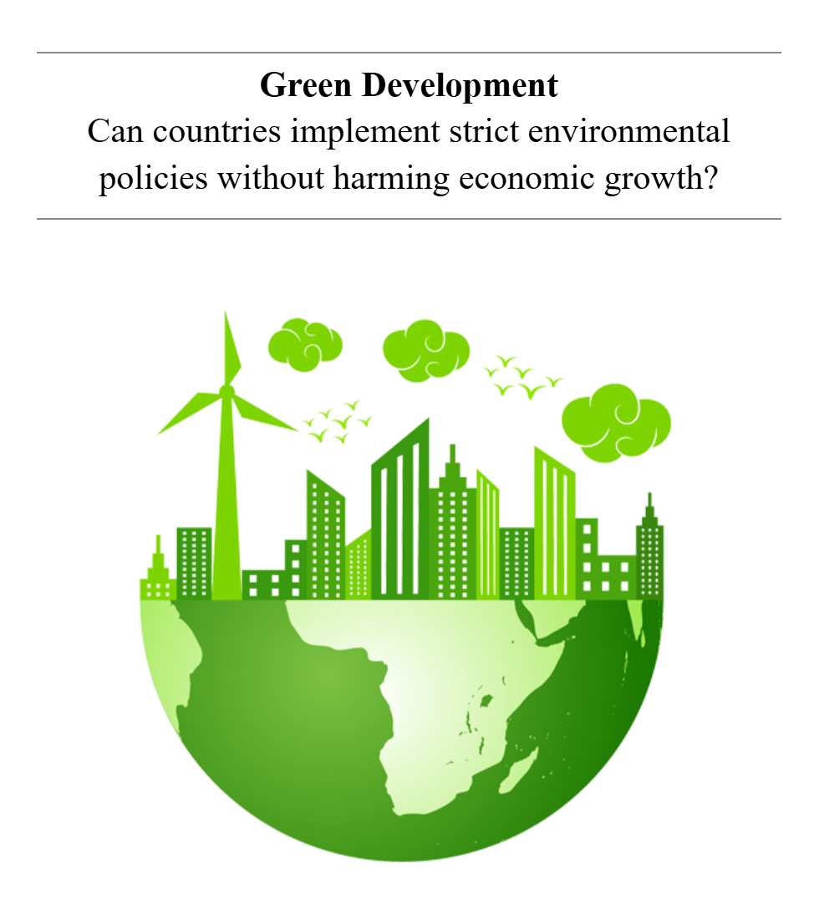
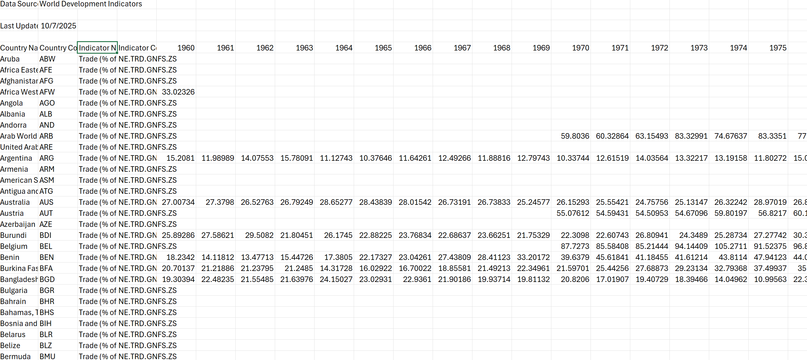
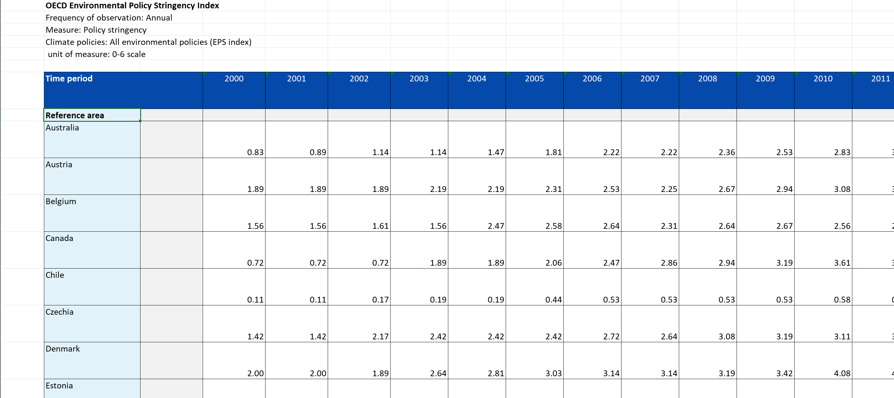
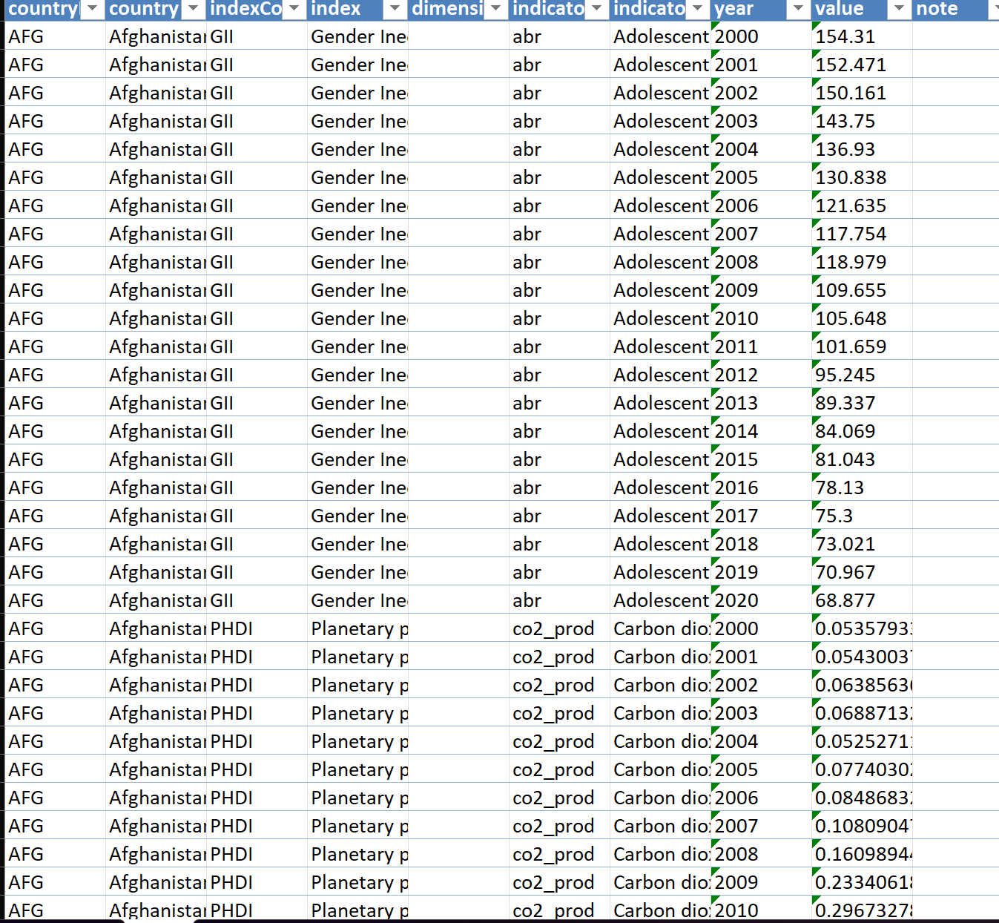
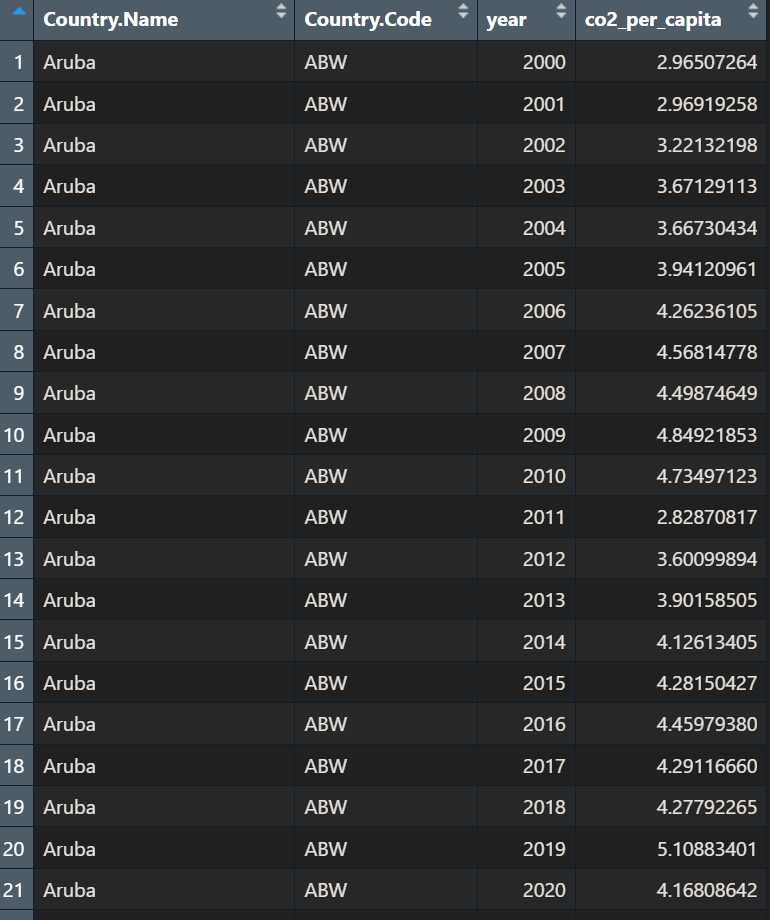
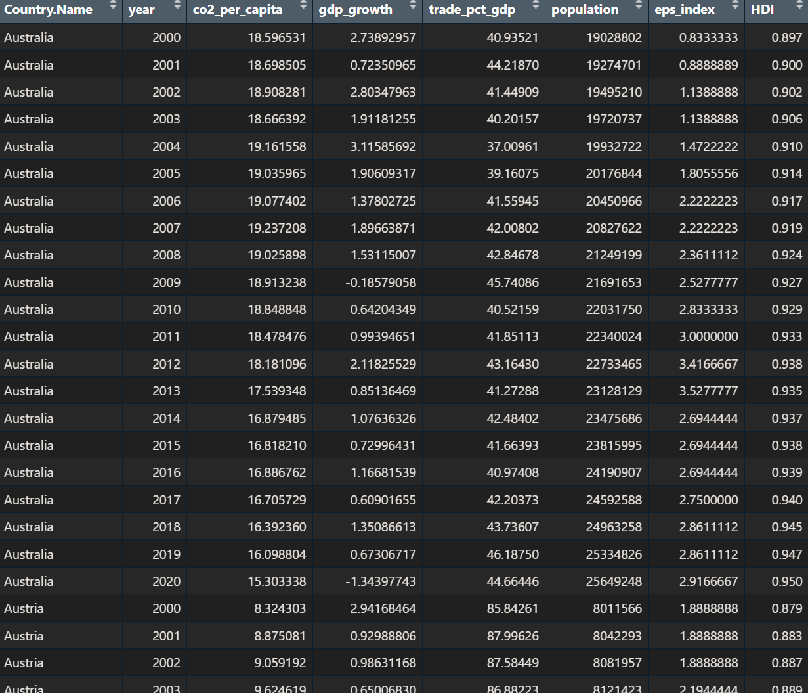

## Project 6: My Extra Element

::::: columns
::: {.column width="50%"}
**What did I do?**

-   Applied data wrangling & visualization skills to economic research

<!-- -->

-   Integrated empirical evidence in said research to test a set of hypotheses
:::

::: {.column width="50%"}
{fig-alt="Image of the front page of an economics research paper titled \"Green Development, Can countries implement strict environmental policies without harming economic growth?\" Picture of the bottom half of a green globe with green skyscrapers. a windmill, clouds, and birds on the top."}
:::
:::::

## The Data

::::: columns
::: {.column width="50%"}
**Sources**

-   The World Bank

-   Organization for Economic Co-operation & Development

-   The United Nations
:::

::: {.column width="50%"}
**Challenges**

-   Peculiar naming conventions

-   Divergent data formats (see next few slides)

-   Missing data (e.g. no GDP data available one year)

-   Irrelevant data points (e.g. regional entities instead of countries)
:::
:::::

## World Bank

::::: columns
:::: columns
::: {.column width="100%"}
{fig-alt="Screenshot of World Bank Data Structure on Excel (to show differences between each data format)"}
:::
::::
:::::

## OECD

::::: columns
:::: columns
::: {.column width="100%"}
{fig-alt="Screenshot of OECD Data Structure on Excel (to show differences between each data format)"}
:::
::::
:::::

## United Nations

::::: columns
:::: columns
::: {.column width="100%"}
{fig-alt="Screenshot of United Nations Data Structure on Excel (to show differences between each data format)"}
:::
::::
:::::

## Example 1: Pivoting & Filtering

::::: columns
::: {.column width="50%"}
**Code:**

```{r}
#| echo: true
#| eval: false
# clean world bank data
clean_wb_data <- function(df, value) {
  df |>
    select(`Country Name`, 
           `Country Code`,
           matches("^[0-9]{4}$")) |>
    pivot_longer(
      cols = matches("^[0-9]{4}$"),
      names_to = "year",
      values_to = value_name
    ) |>
    mutate(year = as.numeric(year)) |>
    filter(year >= 2000 & 
             year <= 2020) |>
    rename(Country.Name = 
             `Country Name`,
           Country.Code = 
             `Country Code`)
}
```
:::

::: {.column width="50%"}
**What it does:**

-   Only keeps 3 columns (select clause)

-   Reshapes data from wide to long format by creating a new 'year' column and 'value' column (pivot_longer clause)

-   Keeps only years of interest (filter clause)
:::
:::::

## Example 1: Output

::::: columns
::: {.column width="50%"}
**Code:**

```{r}
#| echo: true
#| eval: false
# apply cleaning function to a world bank dataset
co2_clean <- clean_wb_data(
  co2_raw, "co2_per_capita")
view(co2_clean)
```
:::

::: {.column width="50%"}
**Output:**

{fig-alt="Screenshot of code output from this slide, showing columns Country.Name, Country.Code, year, & CO2_per_capita"}
:::
:::::

## Example 2: Joining

::::: columns
::: {.column width="50%"}
**Code:**

```{r}
#| echo: true 
#| eval: false 
# merge all data sets into a single data frame
merged_data <- co2_clean |>
  select(Country.Name, 
         year, co2_per_capita) |>
  inner_join(gdp_clean |> 
               select(Country.Name, year, gdp_growth),
             by = c("Country.Name", "year")) |>
  inner_join(trade_clean |> select(Country.Name, year, trade_pct_gdp),
             by = c("Country.Name", "year")) |>
  inner_join(pop_clean |> select(Country.Name, year, population),
             by = c("Country.Name", "year")) |>
  inner_join(oecd_clean |> select(Country.Name, year, eps_index),
             by = c("Country.Name", "year")) |>
  inner_join(hdi_filtered |> select(Country.Name, year, HDI),
             by = c("Country.Name", "year")) |>
  mutate(
    co2_per_capita = as.numeric(co2_per_capita),
    eps_index = as.numeric(eps_index),
    HDI = as.numeric(HDI)
  )
```
:::

::: {.column width="50%"}
**What it does:**

-   Only keeps 3 columns per data set (select clauses)

-   Joins by country name & year (inner_join clauses)

-   Coerces columns to numeric format to prepare for data visualization & regressions (as.numeric)
:::
:::::

## Example 2: Output

:::::: columns
:::: columns
::: {.column width="50%"}
**Code:**

```{r}
#| echo: true 
#| eval: false 
view(merged_data)
```
:::
::::

::: {.column width="50%"}
**Output:**

{fig-alt="Screenshot of code output from last slide, showing columns Country.Name, Country.Code, year, & multiple recorded economic variables"}
:::
::::::

# Summary
